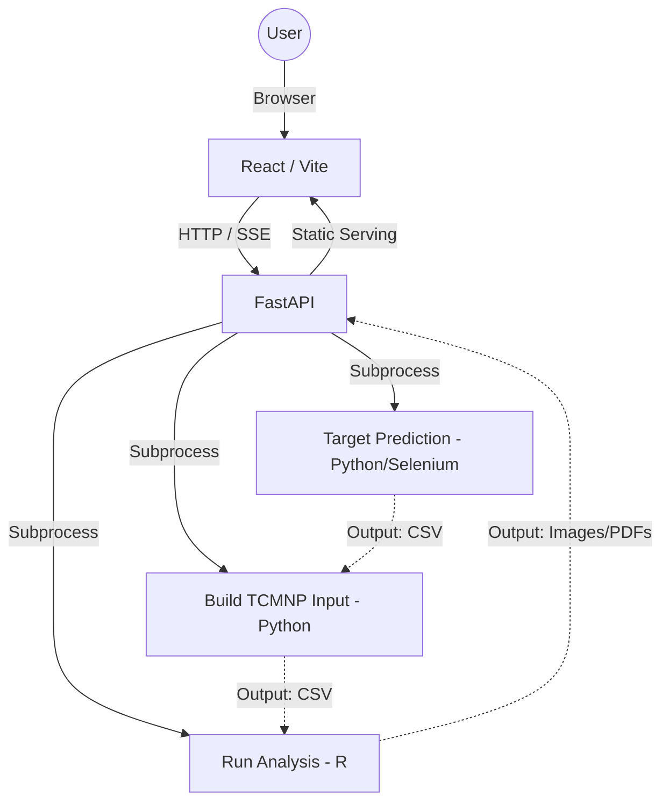

# Developer Manual: Bioinformatics Pipeline GUI Wrapper

This manual provides technical details on the architecture, implementation, and maintenance of the Bioinformatics Pipeline GUI.

---

## 🏗️ Architecture Overview

The system is a decoupled web application consisting of a **React Frontend** and a **FastAPI Backend**. It serves as a modern interface for an existing 3-step bioinformatics pipeline.



---

## 🛠️ Technology Stack

### Backend
- **Framework**: FastAPI (Python 3.10+)
- **Concurrency**: `threading` for background pipeline runs, `asyncio` for Event Streaming.
- **Communication**: Server-Sent Events (SSE) for real-time log streaming.
- **Process Management**: `subprocess.Popen` for non-blocking execution of scripts.

### Frontend
- **Framework**: React 18+ (Vite)
- **API Client**: Axios for standard HTTP, `EventSource` for real-time logs.
- **Styling**: Vanilla CSS, Modern Full-Screen Design (Google/Material-inspired).

### Pipeline Dependencies
- **Target Prediction**: Selenium 4.x (Built-in Selenium Manager), pandas.
- **Input Building**: pandas.
- **Analysis**: R (Version 4.0+), including packages like `dplyr`, `ggplot2`, and `clusterProfiler`.

---

## 📁 Project Structure

```text
np-final-1/
├── backend/
│   ├── app.py              # Main FastAPI application
│   └── README.md           # Backend setup guide
├── frontend/
│   ├── src/
│   │   ├── App.jsx         # Main React component & logic
│   │   ├── App.css         # UI Styling
│   │   └── main.jsx        # Entry point
│   ├── index.html          # HTML template
│   └── package.json        # Dependencies & scripts
├── 1_input_data/           # Uploaded input files
├── 2_target_prediction/    # Script for Step 1
├── 3_tcmnp_input/          # Script and output for Step 2
├── outputs/                # Charts and results from Step 3
└── run_analysis.R          # Script for Step 3
```

---

## ⚙️ Core Logic Implementation

### 1. Real-Time Log Streaming (SSE)
The backend uses **Server-Sent Events (SSE)** to stream logs without blocking.
- **Backend**: `run_pipeline_stream()` thread-safe communication via `Queue`.
- **Frontend**: `EventSource` appends real-time status to the log area.

### 2. Result Serving & Numbering
- **Static Serving**: The `outputs/` directory is mounted via `app.mount`.
- **Sorting & Indexing**: The `/results` endpoint sorts files by **Modification Time** (`os.path.getmtime`).
- **Numbering**: Each file is assigned a sequential index (e.g., "No. 1", "No. 2") representing the order it was generated by the pipeline.
- **Categorization**: The frontend groups these indexed files into "Graphs", "CSVs", and "PDFs" for easy navigation.

### 3. State Management & GUI Redesign
- **Reset State**: A `/reset` endpoint exists to manually clear any hung `pipeline_running` flag.
- **UI Design**: The app recently moved to a **full-screen white/gray layout** to maximize screen real estate for logs and results, replacing the original gradient background.

---

## 🚀 Setup for Developers

### Prerequisites
- Python 3.10+
- Node.js (v16+)
- R (with required packages installed)
- Google Chrome

### Development Commands

**Backend**:
```bash
cd backend
python -m venv venv
source venv/bin/activate  # or venv\Scripts\activate
pip install fastapi uvicorn python-multipart
uvicorn app:app --reload --port 8000
```

**Frontend**:
```bash
cd frontend
npm install
npm run dev -- --port 3000
```

---

## 🧪 Troubleshooting

| Issue | Cause | Solution |
|---|---|---|
| **MIME Type Error** | SSE endpoint returned JSON instead of stream | Ensure pipeline is not already running or check for 500 errors. |
| **Selenium Driver Error** | Network block on webdriver-manager | Script is now updated to use Selenium's built-in manager. |
| **Permission Denied** | Script tried to read directory as file | Backend now resolves the specific file path in `1_input_data/`. |
| **Connection Lost** | Backend crashed or port conflict | Verify `uvicorn` is active and port 8000 is free. |

---

## 📈 Future Improvements
1. **WebSockets**: Transition from SSE to WebSockets for bi-directional control.
2. **Containerization**: Add a `Dockerfile` to handle R and Python dependency isolation.
3. **Database Integration**: Store run history and logs in a SQLite database instead of local directories.
